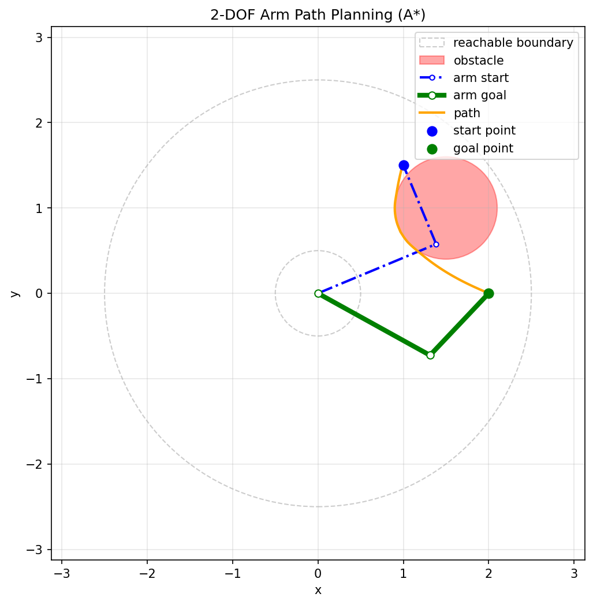

# 2-DOF 机械臂避障路径规划（C-space 版）

一个基于 **C 空间（关节空间）A\* 网格搜索** 的二自由度（2-DOF）平面机械臂避障路径规划示例。程序在机械臂的环形可达工作空间内，为末端执行器规划一条从起点到终点、并绕开圆形障碍物的路径。**碰撞检测覆盖大臂、小臂两条连杆**（而不只是末端点），并会在肘上/肘下两组逆解构型中**自动选择能绕开障碍物、总行程更短的连杆方向**。



## 环境依赖

- Python 3.x
- `numpy`
- `matplotlib`

```bash
pip install numpy matplotlib
```

## 快速开始

```bash
python A_避障规划.py
```

程序启动后会循环读入起点与终点坐标：

```
Reachable area: annulus  r_in=0.5,  r_out=2.5
Obstacle:   center=(1.5, 1.0),  radius=0.6
Planning in C-space (joint space) with full-link collision checking.

start_x start_y goal_x goal_y (q for quit): 1.0 1.5 2.0 0.0
Searching path via C-space A* ...
Goal branch selected: elbow-up (shorter joint-space path)
Path found: 86 configurations
```

输入顺序为 `起点x 起点y 终点x 终点y`，四个数用空格分隔；输入 `q` 退出。

若输入点位于工作空间之外或落在障碍物内部，程序会给出提示并要求重新输入。若两个肘部构型方向都被连杆碰撞堵死（例如障碍物把目标构型的可达自由度完全封死），会输出 `No feasible path found` 并继续等待下一次输入。

## 参数配置

所有参数集中在文件开头，直接修改即可：

| 参数 | 默认值 | 说明 |
| --- | --- | --- |
| `l1` | `1.5` | 大臂（第一连杆）长度 |
| `l2` | `1.0` | 小臂（第二连杆）长度 |
| `step` | `50` | 关节空间插值点数（供 `generate_trajectory` 使用） |
| `OBSTACLE_CENTER` | `[1.5, 1.0]` | 圆形障碍物圆心 |
| `OBSTACLE_RADIUS` | `0.6` | 圆形障碍物半径 |
| `LINK_CLEARANCE` | `0.03` | 连杆（线段）与障碍物边界的最小安全间隙 |
| `PLAN_CLEARANCE` | `0.04` | 搜索/平滑阶段使用的膨胀间隙（真实间隙 + 膨胀量） |
| `CHECK_SPACING` | `0.01` | 插值段碰撞检测的角度采样间距（弧度） |
| `CSPACE_GRID_N` | `126` | C 空间网格划分数（每维 [-π, π) 均分） |

工作空间为一个圆环：内半径 `|l1 - l2| = 0.5`，外半径 `l1 + l2 = 2.5`。障碍物需要放在该圆环内，且直径不宜超过内外半径之差，否则会把可达区域切成互不连通的两块。

## 代码结构

| 函数 | 作用 |
| --- | --- |
| `forward_kinematics(theta1, theta2)` | 正运动学：由两个关节角求基座、肘部、末端三点坐标 |
| `ik_solutions(x, y)` | 逆运动学：返回肘上/肘下两组关节角解 |
| `backward_kinematics(x, y)` | 兼容旧接口：两组逆解中选相对上一次构型转动量更小的一组 |
| `seg_point_dist_sq(p1, p2, c)` | 线段到点的距离平方（纯标量运算，高频调用） |
| `check_collision(theta1, theta2, clearance)` | **连杆碰撞检测**：该构型下大臂、小臂两条线段是否侵入障碍物（含安全间隙） |
| `segment_collision_free(c1, c2, ...)` | 两构型之间按角度线性插值的整段轨迹是否无碰（自动处理 ±π 接缝回绕） |
| `unwrap_configs(path)` | 路径角度解缠，消除相邻构型间 ±2π 跳变 |
| `is_reachable(x, y)` | 判断末端点是否在圆环内且不在障碍物内 |
| `build_cspace_grid()` | 构建 C 空间碰撞图（每个网格构型标记是否连杆碰撞） |
| `astar_cspace(start, goal, ...)` | C 空间 A\*：八邻域扩展、角度环形回绕、**逐边插值碰撞验证** |
| `smooth_configs(path, iterations)` | 关节空间迭代拉直平滑，中点及过渡段均验证无碰 |
| `plan_path(start_xy, goal_xy, ...)` | 综合规划入口：构型选择 → 双分支搜索 → 平滑 → 最终安全校验 |
| `plot_result(...)` | 双图输出：左为工作空间，右为 C 空间碰撞图与搜索路径 |
| `generate_trajectory(...)` / `correct_degree(...)` | 关节空间插值与角度修正的备用工具函数 |

## 实现要点

**为什么在 C 空间规划。** 只在笛卡尔空间对末端点做避障是不够的：末端绕开了障碍物，大臂或小臂仍可能"横扫"过去撞上。把构型 (θ1, θ2) 本身作为规划空间后，每个构型的碰撞可以通过两条连杆的"线段-圆"距离一次性判定，规划结果天然保证**整个运动过程中所有连杆都不侵入障碍物**。

**连杆碰撞检测。** 连杆视为线段，计算线段到障碍物圆心的最近点距离，与 `障碍物半径 + 安全间隙` 比较。安全间隙分两级：规划时用膨胀后的 `PLAN_CLEARANCE`（抵消插值与真实扫掠轨迹的微小偏差），最终校验用真实的 `LINK_CLEARANCE`。

**边级验证与接缝回绕。** 网格节点无碰不代表相邻节点之间的插值段无碰——在障碍物边界切线附近，C 空间碰撞区可能呈薄片状，直接连线会擦碰。因此 A\* 扩展每个邻居前，都对这条边按 `CHECK_SPACING` 采样做插值碰撞检测。两个角度维都是环形的（±π 接缝），插值前会把相差超过 π 的角度分量解回绕，保证沿短弧方向检验。

**连杆方向（构型分支）自动选择。** 目标点的肘上/肘下两组逆解分别独立搜索，比较总关节行程后取更短者；被连杆碰撞堵死的分支自动跳过。起始点同理：优先沿用相对上次构型转动量最小的分支，该分支若连杆碰撞则自动换另一支。

**A\* 搜索。** 起止构型通过取整映射到 C 空间网格，八邻域扩展（对角代价 √2 × 网格距），启发函数取环形回绕后的欧氏距离，用 `heapq` 维护优先队列。搜索迭代上限 200000 次，超出即判定无解。

**路径平滑。** 在关节空间反复把中间构型替换为前后邻点的中点，仅当中点本身及两条过渡插值段都无碰撞时才接受替换，平滑不会破坏避障约束。平滑结果最后按真实间隙、更密采样（0.002 rad）整段复检，不通过则退回未经平滑的原始路径。

## 输出图形说明

程序输出左右双图：

**左图：工作空间**

| 图例 | 含义 |
| --- | --- |
| 灰色虚线圆 | 可达区域内外边界 |
| 红色圆 | 障碍物 |
| 蓝色点划线 | 机械臂起始构型 |
| 绿色实线 | 机械臂目标构型 |
| 淡灰色细线 | 路径中的中间构型（展示机械臂整体如何绕障） |
| 橙色曲线 | 末端执行器路径 |
| 蓝/绿散点 | 起点与终点 |

**右图：C 空间**

| 图例 | 含义 |
| --- | --- |
| 红色区域 | 连杆碰撞构型集合（C 空间障碍） |
| 浅蓝色曲线 | A\* 在关节空间搜出的构型路径 |
| 蓝/绿点 | 起始/目标构型 |

## 已知限制

- **起止构型会被吸附到网格。** 路径首尾附近的构型来自网格取整，与逆解的精确构型存在不超过半个网格（约 0.025 rad）的偏差；末端点偏差通常远小于网格分辨率，肉眼不可辨。
- **插值碰撞检测基于采样。** 构型间插值按固定角度间距采样验证，理论上存在比采样间距更薄的碰撞薄片漏检的可能；膨胀间隙 `PLAN_CLEARANCE` 与最终密采样复检把这一风险降到工程上可忽略。
- **逆解非连续。** `backward_kinematics` 依赖 `theta1_past`、`theta2_past` 两个全局变量；`plan_path` 内部已自行维护解缠与分支选择，如单独复用需自行维护状态。
- `generate_trajectory` 与 `correct_degree` 在当前主流程中**未被调用**，属于关节空间插值与角度修正的备用工具函数。
- 只考虑一个圆形障碍物；多障碍物可在 `check_collision` 中扩展为遍历列表。

## 文件说明

| 文件 | 说明 |
| --- | --- |
| `A_避障规划.py` | 本文档对应的主程序，C 空间 A\* 连杆级避障规划 |
| `机械臂.py` | 二自由度机械臂的早期版本（仅运动学与关节空间插值，无避障） |
| `封装.py` | 机械臂运动学相关封装 |
| `Test-Figure.png` | 示例运行截图（旧版笛卡尔空间规划的输出） |
